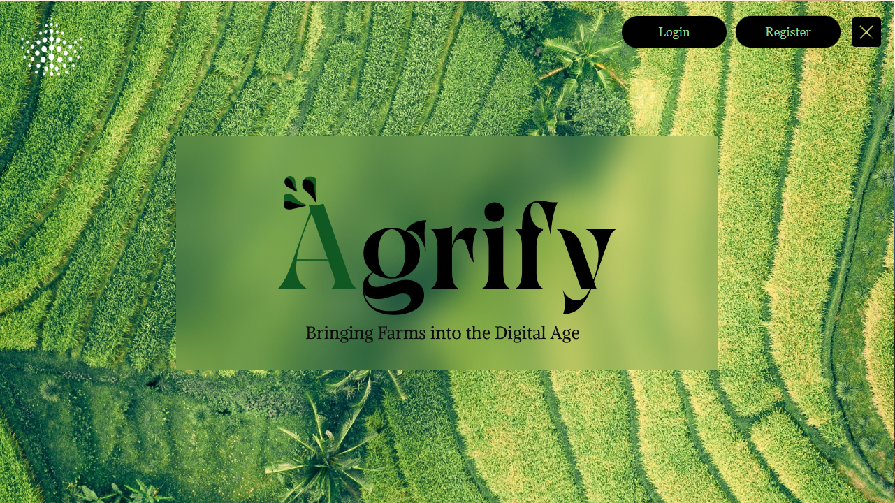

# Agrify - Farm Management App

Agrify is a comprehensive farm management application developed using JavaFX, Scene Builder, and MySQL for database management. The app is designed to streamline various aspects of farm operations, including human resources, field management, animal tracking, materials inventory, production monitoring, and more. Agrify also supports multiple user roles, such as admin and user, with assigned tasks and reclamation features for issue resolution.

## Features

- **User Roles:**
  - **Admin:** Responsible for managing the system, assigning tasks, and overseeing the entire farm operation.
  - **User:** Engaged in day-to-day activities with assigned tasks and the ability to report issues through reclamation.

- **Entities and Management:**
  - **Human Resource Management:** Keep track of farm personnel, their roles, and assignments.
  - **Field Management:** Monitor and manage agricultural fields, including crop types, planting schedules, and harvest dates.
  - **Animal Tracking:** Track livestock information, health records, and breeding details.
  - **Material Inventory:** Manage farm materials, supplies, and equipment.
  - **Production Monitoring:** Keep an eye on the overall production process, from planting to harvesting.

- **Task Assignment:**
  - Admins can assign tasks to users, facilitating efficient task management and delegation.

- **Reclamation System:**
  - Users can submit reclamation requests in case of problems or issues, enabling quick problem resolution.

## Technologies Used

- **JavaFX:** The primary framework for building the graphical user interface.
- **Scene Builder:** A visual layout tool to design UIs without coding.
- **MySQL:** The database management system for storing and retrieving farm-related data.

## Interface

